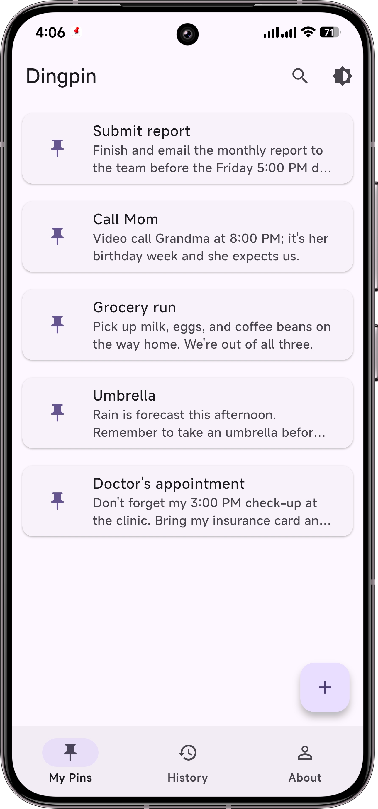
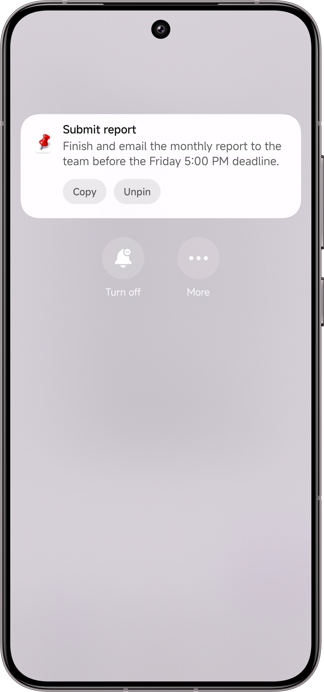
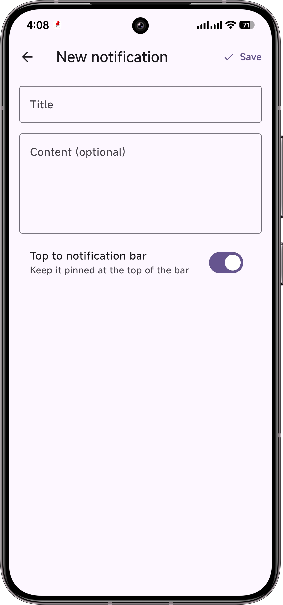
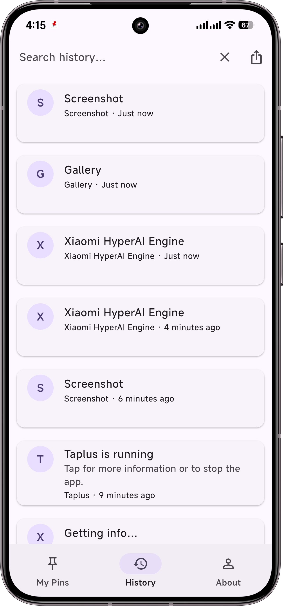

# Dingpin (顶顶)

> 📘 中文文档：[README.zh-CN.md](README.zh-CN.md)

[](https://github.com/CxAxin/Dingpin/releases) [](https://www.android.com) [](LICENSE) [](https://github.com/CxAxin/Dingpin/stargazers) [](https://github.com/CxAxin/Dingpin/commits)

**Dingpin** (顶顶) is an open-source Android app that lets you **pin notes & notifications to your notification panel** so important info never gets lost in the flood.

> Dingpin is a modified version of the open-source [Pinnit](https://github.com/msasikanth/pinnit) project by Sasikanth Miriyampalli, used under the Apache License 2.0. The original Pinnit (Kotlin) is archived; Dingpin is a Flutter/Dart reimplementation that keeps the core "pin to notification shade" idea and adds notification-history capture and more. Attribution and modification notices are in [`NOTICE`](NOTICE); the full license text is in [`LICENSE`](LICENSE).

---

## Features

- **Pin notifications** to the notification shade as persistent (`ongoing`) notifications, with **Copy / Unpin** actions right inside the shade.
- **Create & edit** pinned notes/notifications (title + content + pin toggle) — like sticky notes docked to your notification bar.
- **Notification history** 🆕 — a `NotificationListenerService` records notifications from **all apps** (WhatsApp, WeChat, SMS, email, etc.) into a searchable, time-ordered log.
- **Pin from history** 🆕 — tap any captured notification and pin it straight to the top of your shade as a persistent notification (auto de-duplicated).
- **Add notes** to any captured notification.
- **Export history** — export the log (merged with your pinned notes, de-duplicated) as a text file over a chosen time range (all / 1 day / 1 week / 1 month), saved to Downloads or shared via the system share sheet.
- **Search & filter** the pinned list and the history by title or content.
- **Multi-language** — Chinese / English / follow system.
- **Light & dark** Material 3 themes with a quick toggle.
- **Bottom 3-tab navigation** — Pinned / History / About.

> Requires Android 8.0+ and the **Notification access** permission (granted in system settings) for the history feature.

---

## Download

> Current release: **v2.6.7** (build 267) · requires Android 8.0+

- Official site: **https://dingpin.app**
- Latest APK (arm64): [Baidu Netdisk](https://pan.baidu.com/s/1JdR7dcFpXkfz_7w1TgnydA?pwd=csax)
- Universal APK (all architectures): [Baidu Netdisk](https://pan.baidu.com/s/1Gg2oYybI5WrUrmZ3LgdZsw?pwd=csax)

---

## Screenshots

| Pinned list | Persistent in the shade | Editor | Notification history |
|-------------|-------------------------|--------|----------------------|
|  |  |  |  |

> Screenshots show Dingpin running on Android. Dingpin is a modified version of [Pinnit](https://github.com/msasikanth/pinnit) (Apache-2.0) — see [License & attribution](#license--attribution).

---

## Getting started

### Prerequisites
- [Flutter 3.19+](https://docs.flutter.dev/get-started/install) (stable)
- Android SDK (API 34 recommended) + an emulator or device
- `flutter doctor` should report no Android issues

### Run / build

> This repo already ships the **complete Android shell** (Gradle wrapper, manifest, launcher icon, notification-listener registration). You do **not** need to run `flutter create .` — doing so would overwrite the custom `AndroidManifest.xml` and break the listener setup.

```bash
# 1. Fetch dependencies
flutter pub get

# 2. Run on a connected device / emulator
flutter run

# 3. Build a release APK
flutter build apk --release
# -> build/app/outputs/flutter-apk/app-release.apk
```

Transfer the APK to your phone and install it. On first launch, open **History**
(top bar), tap **Enable**, and grant *Notification access* — that is what lets
Dingpin record other apps' notifications.

---

## Project layout

```
lib/
  main.dart                         # entry: init bridges + NotificationService
  app.dart                          # MaterialApp + theme + navigator key
  providers.dart                    # themeMode + thirdParty export
  data/
    notification_model.dart        # PinnitNotification (pinned note model)
    third_party_notification.dart  # ThirdPartyNotification (history capture)
    app_database.dart              # sqflite wrapper (v5 schema)
  repositories/
    notifications_repository.dart # Riverpod Notifier: pinned list + mutations
    third_party_repository.dart   # Riverpod Notifier: history list + mutations
  services/
    notification_service.dart      # flutter_local_notifications: pin/copy/unpin
    notification_listener_bridge.dart # MethodChannel <-> native listener
    pins_bridge.dart               # native keep-alive / repin bridge
  notifications/
    notifications_screen.dart      # home list + search
    notification_tile.dart         # list row + pin toggle
    history_screen.dart            # captured-notifications log + notes + pin/export
  editor/
    editor_screen.dart             # create/edit + pin UI
  about/
    about_screen.dart              # About + attribution
  theme/theme.dart                 # M3 light/dark
  utils/navigator_key.dart         # deep-link from notification tap
android/
  app/src/main/kotlin/com/pinnit/flutter/
    PinnitApplication.kt           # cached FlutterEngine (background listener)
    PinnitPins.kt                  # native pin/repin bridge
    PinnitNotificationListenerService.kt # captures other apps' notifications
  app/src/main/AndroidManifest.xml # permissions + listener-service registration
docs/
  NOTIFICATION_LISTENER.md         # listener design notes
```

---

## License & attribution

- The original **Pinnit** is © 2020 Sasikanth Miriyampalli, licensed under the
  [Apache License 2.0](https://www.apache.org/licenses/LICENSE-2.0).
- Dingpin is a derivative work provided under the **same Apache-2.0 license** for
  the portions derived from it. The full license text is in [`LICENSE`](LICENSE),
  and attribution / modification notices are in [`NOTICE`](NOTICE). Core source
  files carry a "modified, derived from Pinnit" header at the top.

Package name: `com.pinnit.flutter` (kept from the original port).
